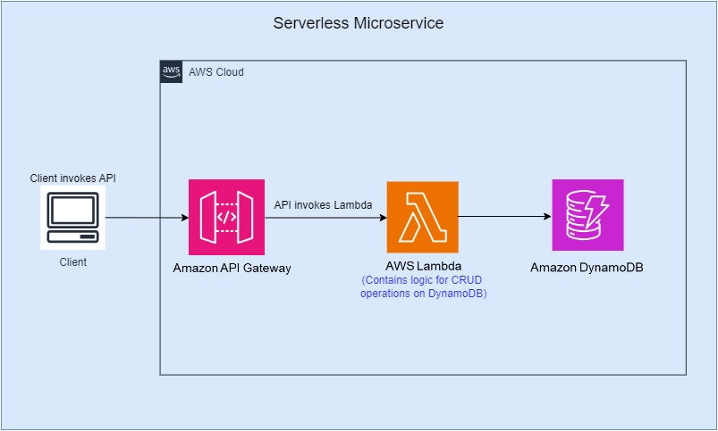
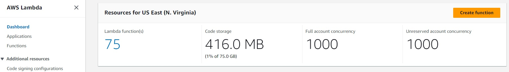
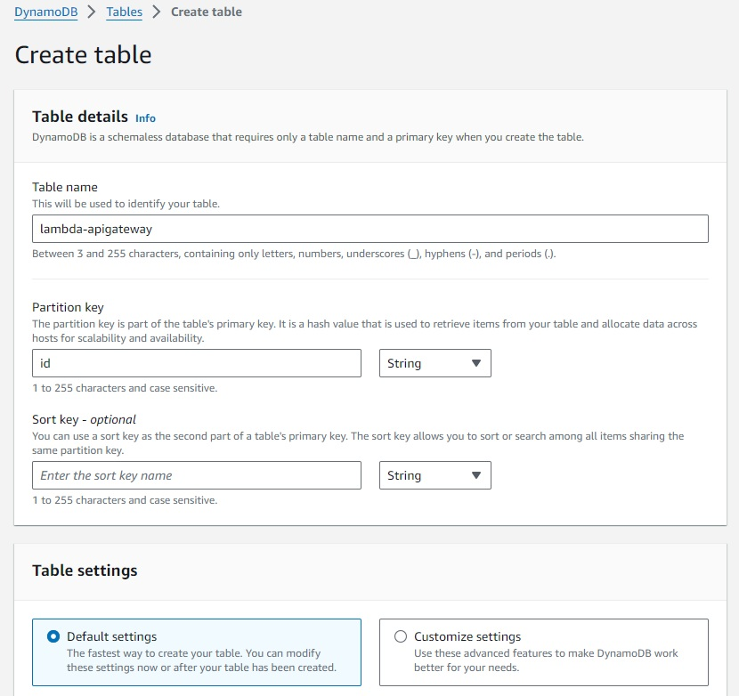
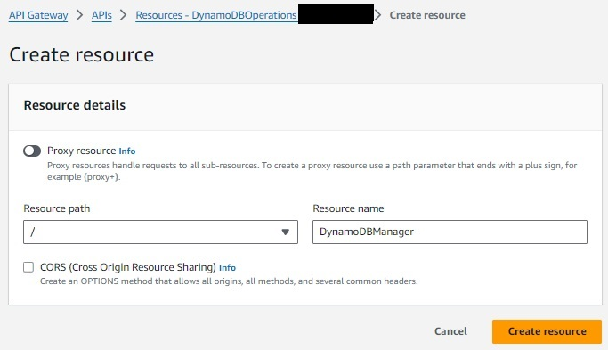
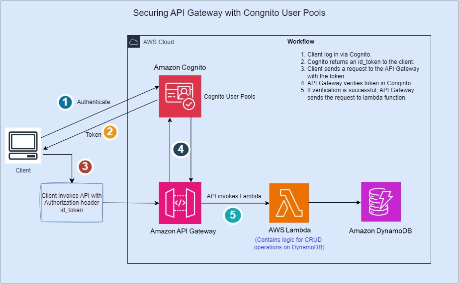

#  Serverless Microservices with Load Test

## Overview And High Level Design

Let's start with the High Level Design.



An Amazon API Gateway is a collection of resources and methods. For this hand-on, you create one resource (DynamoDBManager) and define one method (POST) on it. 
The method is backed by a Lambda function (LambdaFunctionOverHttps). That is, when you call the API through an HTTPS endpoint, Amazon API Gateway invokes the Lambda function.

The POST method on the DynamoDBManager resource supports the following DynamoDB operations:

* Create, update, and delete an item.
* Read an item.
* Scan an item.
* Other operations (echo, ping), not related to DynamoDB, that you can use for testing.

The request payload you send in the POST request identifies the DynamoDB operation and provides necessary data. For example:

The following is a sample request payload for a DynamoDB create item operation:

```json
{
    "operation": "create",
    "tableName": "lambda-apigateway",
    "payload": {
        "Item": {
            "id": "1",
            "name": "Bob"
        }
    }
}
```
The following is a sample request payload for a DynamoDB read item operation:
```json
{
    "operation": "read",
    "tableName": "lambda-apigateway",
    "payload": {
        "Key": {
            "id": "1"
        }
    }
}
```

## Setup

### Create a Custom Policy

To create an Lambda IAM execution role, first create the custom policy to be attached to the execution role.
This custom policy will have permission to DynamoDB and CloudWatch Logs, required to write data to DynamoDB and upload logs. 

1. Open the Policies page in the IAM console.
2. Choose Create policy
3. Choose JSON as Policy editor
4. Add the permissions for the policy -
   
    ```json
    {
    "Version": "2012-10-17",
    "Statement": [
    {
      "Sid": "Stmt1428341300017",
      "Action": [
        "dynamodb:DeleteItem",
        "dynamodb:GetItem",
        "dynamodb:PutItem",
        "dynamodb:Query",
        "dynamodb:Scan",
        "dynamodb:UpdateItem"
      ],
      "Effect": "Allow",
      "Resource": "*"
    },
    {
      "Sid": "",
      "Resource": "*",
      "Action": [
        "logs:CreateLogGroup",
        "logs:CreateLogStream",
        "logs:PutLogEvents"
      ],
      "Effect": "Allow"
    }
    ]
    }
    ```


6. Choose Next
7. Policy name – **lambda-dynamoDB-cloudWatch-policy**
8. Choose Create policy

### Create Lambda IAM Role

Create the execution role that gives your function permission to access AWS resources.

1. Open the roles page in the IAM console.
2. Choose Create role.
3. Create a role with the following properties.
    * Trusted entity type – AWS service.
    * Use case - Lambda
    * Permissions policy – Choose **lambda-dynamoDB-cloudWatch-policy** that we created earlier.
    * Role name - **lambda-apigateway-role**

### Create Lambda Function

**To create the function**
1. Click "Create function" in AWS Lambda Console



2. Select "Author from scratch". Use name **LambdaFunctionOverHttps** , select **Python 3.12** as Runtime. Under Permissions, select "Use an existing role", and select **lambda-apigateway-role** that we created, from the drop down

3. Click "Create function"


4. Replace the boilerplate coding with the following code snippet and click "Deploy"

**Example Python Code**
```python
from __future__ import print_function

import boto3
import json

print('Loading function')


def lambda_handler(event, context):
    '''Provide an event that contains the following keys:

      - operation: one of the operations in the operations dict below
      - tableName: required for operations that interact with DynamoDB
      - payload: a parameter to pass to the operation being performed
    '''
    #print("Received event: " + json.dumps(event, indent=2))

    operation = event['operation']

    if 'tableName' in event:
        dynamo = boto3.resource('dynamodb').Table(event['tableName'])

    operations = {
        'create': lambda x: dynamo.put_item(**x),
        'read': lambda x: dynamo.get_item(**x),
        'update': lambda x: dynamo.update_item(**x),
        'delete': lambda x: dynamo.delete_item(**x),
        'list': lambda x: dynamo.scan(**x),
        'echo': lambda x: x,
        'ping': lambda x: 'pong'
    }

    if operation in operations:
        return operations[operation](event.get('payload'))
    else:
        raise ValueError('Unrecognized operation "{}"'.format(operation))
```


### Test Lambda Function

Let's test our newly created function. We haven't created DynamoDB and the API yet, so we'll do a sample echo operation. The function should output whatever input we pass.
1. Click the arrow on "Test" and click "Configure test event"


2. Paste the following JSON into the event. The field "operation" dictates what the lambda function will perform. In this case, it'd simply return the payload from input event as output. Put event name as "echotest" and click "Save".
```json
{
    "operation": "echo",
    "payload": {
        "somekey1": "somevalue1",
        "somekey2": "somevalue2"
    }
}
```


3. Click "Test", and it will execute the test event. You should see the output in the console


We're all set to create DynamoDB table and an API using our lambda as backend!

### Create DynamoDB Table

Create the DynamoDB table that the Lambda function uses.

**To create a DynamoDB table**

1. Open the DynamoDB console.
2. Choose Create table.
3. Create a table with the following settings.
   * Table name – lambda-apigateway
   * Primary key – id (string)
4. Choose "Create table".




### Create API

**To create the API**
1. Go to API Gateway console
2. Click Create API

 

3. Scroll down and select "Build" for REST API

 

4. Give the API name as "DynamoDBOperations", keep everything as is, click "Create API"


5. Each API is collection of resources and methods that are integrated with backend HTTP endpoints, Lambda functions, or other AWS services. Typically, API resources are organized in a resource tree according to the application logic. At this time you only have the root resource, but let's add a resource next. 

Click "Create Resource".


6. Input "DynamoDBManager" in the Resource Name. Click "Create Resource". 



Resource Path will get displayed as provided.

7. Let's create a POST Method for our API. With the "/dynamodbmanager" resource selected, Click "Create Method" under "Methods" section. 


8. Select "POST" from Method type drop down.


9. The integration will come up automatically with "Lambda Function" option selected. Select "LambdaFunctionOverHttps" function that we created earlier. As you start typing the name, your function name will show up. Select function and click "Create method".


Our API-Lambda integration is done!

### Deploy the API

In this step, you deploy the API that you created to a stage called prod.

1. On the Resources screen, with "POST" selected, click "Deploy API"


2. A "Deploy API" pop-up will come, asking you about a stage. Select "[New Stage]" for "Stage". Give "Prod" as "Stage name" and click "Deploy"


3. We're all set to run our solution! To invoke our API endpoint, we need the endpoint url. In the "Stages" screen, expand the stage "Prod", select "POST" method, and copy the "Invoke URL" from screen


### Running our solution

1. The Lambda function supports using the create operation to create an item in your DynamoDB table. To request this operation, use the following JSON:

```json
{
    "operation": "create",
    "tableName": "lambda-apigateway",
    "payload": {
        "Item": {
            "id": "1234ABCD",
            "number": 5
        }
    }
}
```
2. To execute our API from local machine, we are going to use Postman or Curl command. You can choose either method based on your convenience and familiarity. 
   * To run this from Postman, select "POST" , paste the API invoke url. Then under "Body" select "raw" and paste the above JSON. Click "Send". API should execute and return "HTTPStatusCode" 200.


* To run this from terminal using Curl, run the below
    ```
    $ curl -X POST -d "{\"operation\":\"create\",\"tableName\":\"lambda-apigateway\",\"payload\":{\"Item\":{\"id\":\"1\",\"name\":\"Bob\"}}}" https://$API.execute-api.$REGION.amazonaws.com/prod/DynamoDBManager
    ```   
3. To validate that the item is indeed inserted into DynamoDB table, go to Dynamo console, click-on "Explore items", select "lambda-apigateway" table, and the newly inserted item should be displayed.


4. To create few more items in your DynamoDB table, you can repeat step 2 few more times, with different "id" and "number" values in the json payload.

    

5. Repeat step 3 to see all the newly inserted items in the DynamoDB table.

    

6. To get all the inserted items from the table, we can use the "list" operation of Lambda using the same API. Pass the following JSON to the API, and it will return all the items from the Dynamo table

```json
{
    "operation": "list",
    "tableName": "lambda-apigateway",
    "payload": {
    }
}
```


We have successfully created a serverless API using API Gateway, Lambda, and DynamoDB!


## API Performance Testing

API performance testing can help you:
* Ensure your API can handle the expected load and check how the API responds to changes in load (load is the number of parallel users hitting your APIs at the same time).
* Optimize and improve the API’s performance to ensure a better user experience.
* Identify any bottlenecks, latency, and failures and determine the scalability of the system.

### API Performance Testing using Postman

1. Create a new Collection by following below steps:
* Open the Postman desktop app and login.
* Inside your workspace, create a new collection by clicking on Create new collection  and selecting “Blank collection”.


* Rename the collection “Serverless API Performance Testing” and click on “Add a request”.


* In the new request, select "POST” and paste the API invoke url. Then under "Body" select "raw" and paste the below JSON and click Save. This setup is like step 6, under Running our solution described above.

```json
{
    "operation": "list",
    "tableName": "lambda-apigateway",
    "payload": {
    }
}
```


2. Capture the current lambda Configuration.
* Go to AWS Lambda Console and open the “LambdaFunctionOverHttps” function, created earlier.
* Go to “Configuration” and select “General configuration”, note down the default memory and timeout.


3. API performance testing
* For the collection created above, select “View more actions” and select “Run collection”. This will open a “Runner” screen.


* Select the Performance tab under Runner
* Specify the virtual users, test duration and load profile to simulate the load condition and click Run.


* Observe the average response time, throughput and error rate in real time.


### Improve API performance

1. One of the ways to accelerate AWS Lambda performance is by increasing memory allocation.

* Go back to your lambda , “LambdaFunctionOverHttps” and increase the memory allocation.


* Rerun the performance test in Postman
* Observe the improvement in performance


# Secure Your AWS API Gateway Using Cognito

## Overview And High Level Design

Let's start with the High Level Design.



By default, your API Gateway endpoints are not secured, so anyone with the endpoint url, can access it. One of the services you can use for managing your users and the sign-up/sign-in flows is Amazon Cognito.

You can use an Amazon Cognito user pool to control who can access your API in Amazon API Gateway.

To use an Amazon Cognito user pool with your API, you must first: 
* Create an authorizer of the COGNITO_USER_POOLS type
* Then configure an API method to use that authorizer and deploy the API.
* Then the client must first sign the user in to the user pool, obtain an identity or access token for the user, and then call the API method with one of the tokens.
* Tokens are set to the request's Authorization header.
* The API call succeeds only if the required token is supplied and the supplied token is valid, otherwise, the client isn't authorized to make the call.

I am going to show how to set up this whole flow, creating a User Pool, signing up and signing in users, then getting the id_token and provide this to the API Gateway, in the Authorization header.
We are also going to setup the Cognito Authorizer in API Gateway, which will handle this authorization flow.

**Create a User Pool in AWS Cognito**
* Open the AWS Management Console and navigate to Amazon Cognito.
* Choose “Manage User Pools,” then “Create a User Pool.”


## Cleanup

Let's clean up the resources we have created for this lab.

### Cleaning up

* To delete the table, from DynamoDB console, select the table "lambda-apigateway", and click "Delete"


* To delete the Lambda, from the Lambda console, select lambda "LambdaFunctionOverHttps", click "Actions", then click Delete


* To delete the API we created, in API gateway console, under APIs, select "DynamoDBOperations" API, click "Actions", then "Delete"
  
 
  

